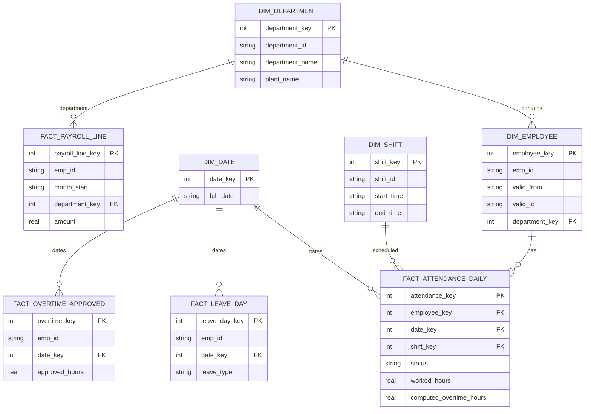

# ER diagram (Mermaid source)

```mermaid
erDiagram
  DIM_DEPARTMENT ||--o{ DIM_EMPLOYEE : contains
  DIM_EMPLOYEE ||--o{ FACT_ATTENDANCE_DAILY : has
  DIM_DATE ||--o{ FACT_ATTENDANCE_DAILY : dates
  DIM_SHIFT ||--o{ FACT_ATTENDANCE_DAILY : scheduled
  DIM_DATE ||--o{ FACT_LEAVE_DAY : dates
  DIM_DATE ||--o{ FACT_OVERTIME_APPROVED : dates
  DIM_DEPARTMENT ||--o{ FACT_PAYROLL_LINE : department
  DIM_EMPLOYEE {
    int employee_key PK
    string emp_id
    string valid_from
    string valid_to
    int department_key FK
  }
  DIM_DEPARTMENT {
    int department_key PK
    string department_id
    string department_name
    string plant_name
  }
  DIM_SHIFT {
    int shift_key PK
    string shift_id
    string start_time
    string end_time
  }
  DIM_DATE {
    int date_key PK
    string full_date
  }
  FACT_ATTENDANCE_DAILY {
    int attendance_key PK
    int employee_key FK
    int date_key FK
    int shift_key FK
    string status
    real worked_hours
    real computed_overtime_hours
  }
  FACT_LEAVE_DAY {
    int leave_day_key PK
    string emp_id
    int date_key FK
    string leave_type
  }
  FACT_OVERTIME_APPROVED {
    int overtime_key PK
    string emp_id
    int date_key FK
    real approved_hours
  }
  FACT_PAYROLL_LINE {
    int payroll_line_key PK
    string emp_id
    string month_start
    int department_key FK
    real amount
  }
```
